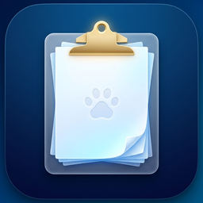
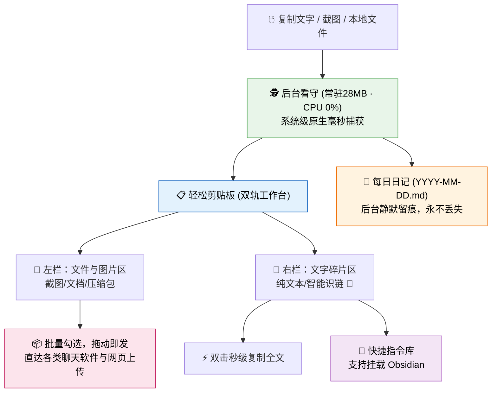
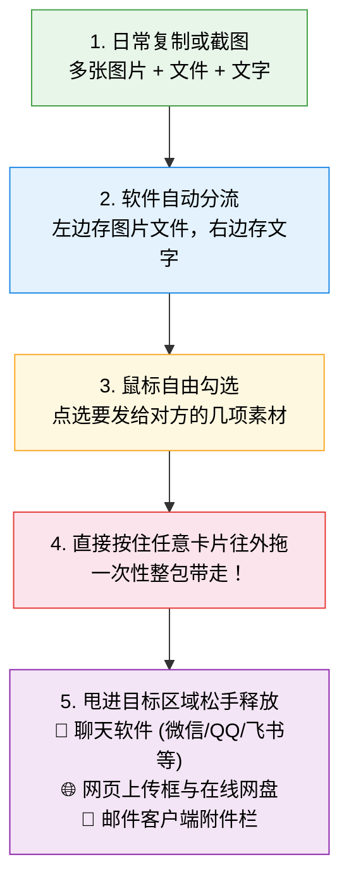
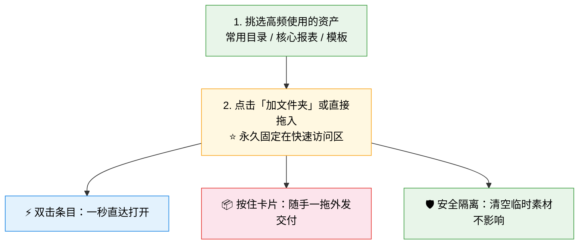
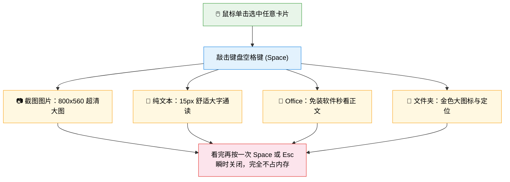
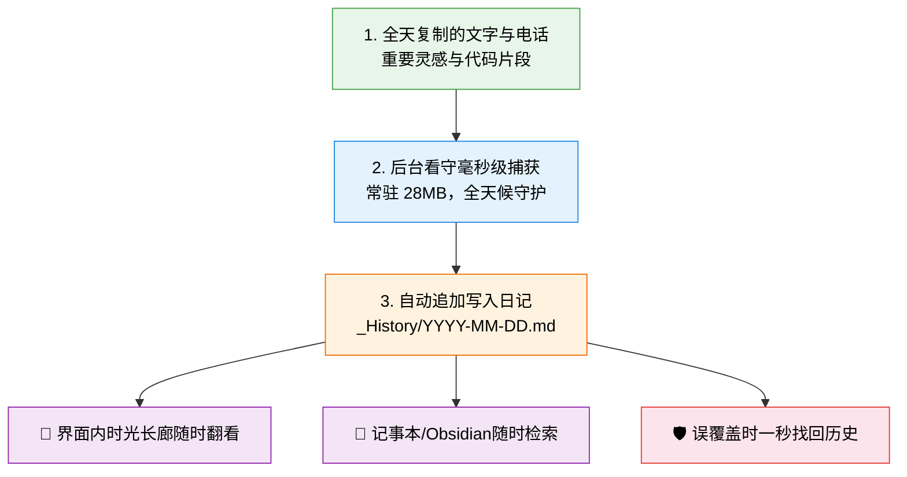
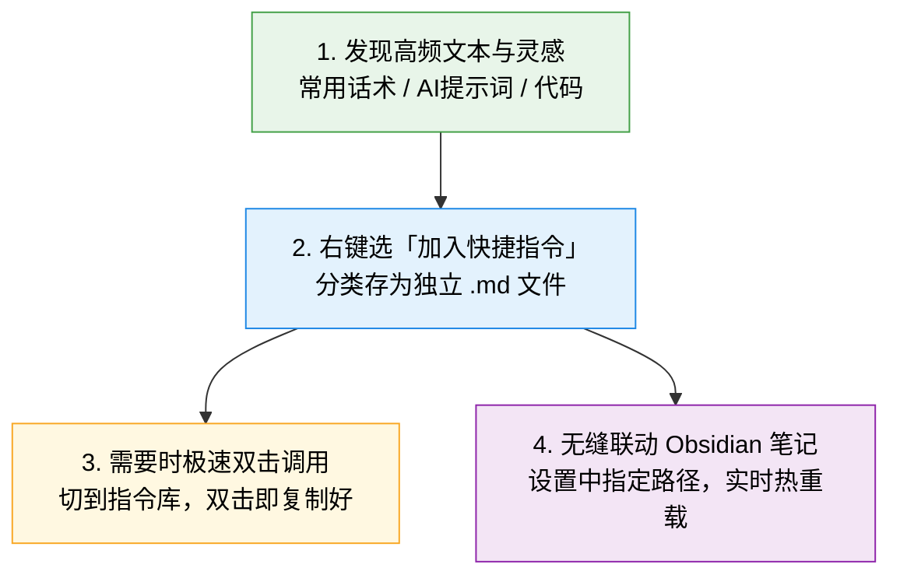
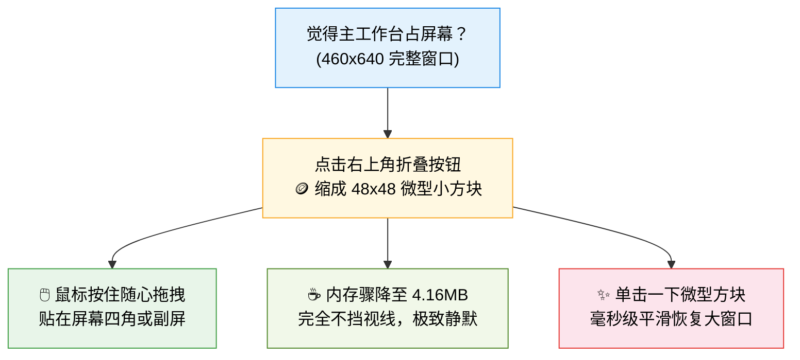

<p align="center">
  
  <h1 align="center">📋 轻松剪贴板 · EasyClipboard</h1>
  <p align="center">
    <b>桌面级双轨临时中转架 · 每日自动工作剪贴日志 · 快捷指令提示词库 · 极速大图与 Office 预览</b><br/>
    一款开源、原生高清、极致轻量、100% 隐私离线的桌面剪贴板增强工作台。<br/>
    <b>一次复制即归档 · 一贴一拖全交付 · 永久留痕不丢失</b>
  </p>
  <p align="center">
    <a href="#-为什么选择-easyclipboard">设计初衷</a> · 
    <a href="#-功能全景与核心特性">功能全景</a> · 
    <a href="#-五大高频使用场景实操">实战指南</a> · 
    <a href="#-键鼠高效操作秘籍">快捷键大全</a> · 
    <a href="#-系统级硬核黑科技">底层技术</a> · 
    <a href="#-下载与安装">快速开始</a>
  </p>
  <p align="center">
    
    
    
    
    
    
    
    
  </p>
</p>

---

## 🤔 为什么需要安装使用 EasyClipboard？

> 在日常高频的办公与沟通中，你一定经历过这些让人抓狂的瞬间——

- 💥 **刚整理好的内容被手滑覆盖**：精心整理了一大段会议纪要，按下 `Ctrl+C`，切到聊天窗口准备发送时顺手按了别的复制……**刚才的内容就永远消失了，追悔莫及**。
- 💥 **想回忆今天复制过的数据**：在浏览器、文档和聊天窗口之间来回切了一整天，到了晚上想找回下午复制过的一条关键电话或代码，**一条都找不回来**。
- 💥 **发多份材料来回切换像搬砖**：要给同事或客户发多张截图、几段话术和表格，**只能来回切换窗口复制粘贴 5~6 次，手忙脚乱、费时费力**。
- 💥 **常用话术与提示词散落一地**：常用的 AI 提示词、邮件模板、客诉回复散落在各种备忘录、便签或收藏夹里，**每次想用时都要翻找半天**。

> 💡 **这些痛点，正是我们打造「轻松剪贴板」的原因。**  
> 它不是一个臃肿复杂的平台，而是专注于把剪贴板的**“捕获、暂存、留痕与交付”**做到极致——**让你的每一次复制都安全可靠、随取随用、永不丢失！**

---

## ✨ 功能全景：普通人 1 分钟就能看懂的核心本领

> 💡 **用一句话概括它的用法**：  
> **你在电脑上平时怎么复制，还怎么复制 → 软件在后台自动帮你分门别类存好 → 需要用时一按一拖，轻松搞定！**



---

### 🍱 本领 1：左右自动分门别类，多选随心“一键整包拖走”



- **你在任何软件里按 `Ctrl+C` 或截图**，不用任何多余操作：
  - **左边栏（文件与图片区）**：新截的图片、复制的 Word/Excel/压缩包、文件夹，自动整整齐齐排在左边；
  - **右边栏（文字碎片区）**：复制的文本、网址链接排在右边，如果是网址还会自动贴上精致的 🔗 链接图标；
- **🔥 核心杀手锏：一键整包拖走（彻底干掉反复切换的痛苦！）**
  - **以前传材料**：要发送多张截图、表格和说明，得在聊天窗口/浏览器和桌面之间**来回切 6 次，复制粘贴 6 次**；
  - **现在用它**：鼠标勾选好想发的内容，**直接按住选中的任意一张卡片往外一拖**，甩进各类**聊天软件（微信/QQ/飞书等 IM）、网页上传框、网盘或邮件附件**松手——所有勾选素材一次性整包交付！
- **双击极速自响应**：双击文字卡片直接复制回剪贴板；双击文件直接调系统软件打开。

---

### ⭐ 本领 2：常用文件夹 & 核心报表“一键固定直达”（快速访问区）



- 你的电脑里一定有几个每天都要打开的文件夹或 Excel 表格，以往总要在“我的电脑”里一层一层点开，费时费力；
- **快速访问区就是你的专属资产百宝箱**：
  - 点击「加文件夹」或直接把文件拖进来，永久固定在侧边；
  - **双击直达**：双击文件夹秒开，双击文件调用默认程序打开；
  - **随手拖拽外发**：按住卡片直接拖进各类聊天软件（IM）、网页附件上传框或邮件中，秒发给客户或同事；
  - **清空安全隔离**：清空临时剪贴板素材时，快速访问区受永久隔离保护，**绝不丢失**。

---

### 🔍 本领 3：按一下键盘空格键（Space），不用等 Office 也能秒看文件内容



- 列表中素材多了，光看文件名不知道具体写了啥？双击打开 Word/Excel 又要等好几秒？
- **鼠标点一下任意卡片，轻轻按一下键盘 <kbd>Space 空格键</kbd>**，立刻弹出宽敞清晰的大预览窗口：
  - 📷 **高清截图**：直接看 800×560 超清大图，底部还贴心标明图片尺寸与大小；
  - 📝 **文字与代码**：15px 舒适大字号通读全文，字数行数清清楚楚，还配有一键复制全文按钮；短文本自动收缩变紧凑，绝不留多余空白；
  - 📄 **Word 文档 (`.docx`)**：电脑没装 Office 也能秒开，直接提炼通读全文段落正文；
  - 📊 **Excel 表格 (`.xlsx`)**：直接以规整的网格表格呈现前几行前几列的核心数据预览；
  - 📽️ **PPT 幻灯片 (`.pptx`)**：一页一页提取出每张幻灯片的标题与演讲提纲；
  - 📁 **文件夹**：展示原生金色文件夹大图标，告诉你里面有几个文件，还配有“在文件夹中定位”直达按钮；
- **看完后再按一下空格键或 Esc**，窗口瞬间关闭，完全不占你的电脑内存！

---

### 📖 本领 4：默默为你写一整天的工作日记，文字永不丢失



- 你一定经历过这种崩溃：精心整理好的一大段关键纪要刚按了复制，下一秒手滑又复制了别的东西，**刚才的内容就永远丢了**；
- 轻松剪贴板在后台有一个“全天候值班管家”：
  - 你今天复制过的每一句重要文字、客户电话、灵感代码，都会自动按时间追加写进今天的专属日记文件里（`_History/2026-09-09.md`）；
  - **就算你一整天都没打开过主界面**，只要电脑开着，它就会在后台默默帮你记下每一条；
  - 想回忆今天或上周复制过的某条数据？点击顶部的「今日日志」翻看，或者直接在电脑里用记事本打开那天的日记即可！

---

### ⚡ 本领 5：常用话术 & AI 提示词随身小口袋（支持连通 Obsidian）



- 工作中总有反复使用的文本：常用邮件模板、客服话术、ChatGPT / 绘图提示词、常用代码……
- **看到好的，一秒存起来**：在卡片上右键选择「加入快捷指令」，存进自己建的分类目录；
- **想用的时候，双击就能用**：点击顶栏切换到「快捷指令」，双击对应卡片直接复制好，切回文档直接粘贴；
- **还能无缝连到 Obsidian**：如果你习惯用 Obsidian 记笔记，在设置面板里把提示词目录直接选到你的 Obsidian 笔记本里，两边修改实时同步！

---

### 🪙 本领 6：像硬币一样小巧，贴在桌面角落完全不挡视线



- 觉得主窗口占屏幕？
- 点击右上角折叠按钮 `—`，面板立刻缩小为只有 **48×48 像素**的精致小圆球（面积只有原先的 1/4，就如一枚硬币大小）；
- **按住鼠标随便拖**：可以拖到副屏或屏幕四个角落贴边放着，完全不遮挡正在写字或看剧的视线；
- **需要时点一下秒展开**：鼠标点它一下，立刻平滑恢复成完整大工作台！

---

### ⚙️ 本领 7：清爽贴心的设置中心（素材想留几天你说了算）
- 点击齿轮（⚙）打开设置面板，四大卡片清爽呈现：
  - **🎨 换肤随心**：酷黑深色（macOS Dark 质感）/ 纯净浅色（高对比度清爽），还可以随意调整磨砂半透明度；
  - **⏰ 素材保留几天你说了算**：默认保留 7 天，到期自动把过期截图清理掉不占磁盘；也可以自由选 3 天、24 小时、永不清理，或者自己输入想要的天数（比如自定义保留 15 天）；
  - **📁 存储位置自由搬家**：想把数据存在 D 盘或移动硬盘？点击“更改”挑个文件夹即可，即刻生效。

---

### 📊 普通剪贴板 vs 轻松剪贴板（一目了然对比表）

| 日常高频场景 | 普通 Windows 自带剪贴板 | 轻松剪贴板 (EasyClipboard) |
| :--- | :--- | :--- |
| **外发一堆图文材料** | 复制一次切一次窗口，重复来回切 5~6 遍 | **勾选全部素材，鼠标一拖，整包送达聊天软件(IM)或网页上传** |
| **重要文字被误触覆盖** | 覆盖了就彻底丢了，追悔莫及 | **每日日记后台自动追加，随时翻看历史记录** |
| **查看收到的 Office 文件** | 必须双击等臃肿的 Office 软件漫长启动 | **按一下键盘空格键，秒级弹出宽屏大字通读** |
| **常用话术与 AI 提示词** | 散落在各种备忘录、便签或微信收藏里 | **按分类整理在快捷指令库，支持双向挂载 Obsidian** |
| **工作时屏幕被遮挡** | 关掉后又得重新按快捷键重新呼出 | **一键收成硬币大小贴在角落，需要时点一下秒展开** |
| **高分屏/大屏幕字迹** | 容易文字发虚、泛白模糊、显得廉价 | **硬件级原生逐点物理渲染，字迹像印刷品一样清晰** |
| **电脑内存资源开销** | 很多同类软件开着占 300MB~600MB | **收起时物理内存仅 4.16MB，完全不拖慢电脑速度** |

---

## 🚀 系统级硬核黑科技（极致轻量与高清）

轻松剪贴板虽然界面小巧，但在系统底层体验上做足了工匠级打磨：

1. **🖥️ 4K 硬件级原生高清**：针对 Windows 各种缩放比例（125%、150%、200%）激活原生逐点物理渲染，文字和图标像印刷品一样扎实锐利，**彻底告别泛白发虚和模糊廉价感**；
2. **🪶 内存深度休眠（收起仅 4.16MB）**：当面板折叠成硬币小方块或隐藏到后台时，系统会自动回收物理内存，**工作集瞬间压缩至 4.16MB**，后台常驻看守仅 28MB，整天开着电脑依然丝滑飞快；
3. **🛡️ 100% 离线隐私安全**：完全不联网、无任何数据上传或分析埋点，所有历史记录与提示词都是您电脑里的本地纯净 Markdown 文件，**安全可审计、随时自由备份与迁移**。

---

## 🎯 五大高频使用场景实操

### 场景一：多图文资料“整包打包”秒投聊天软件或网页上传
1. 在网页、邮件中依次复制多张截图和所需文件；
2. 呼出 EasyClipboard，素材已自动分流归入左右两栏；
3. 鼠标点选勾选需要的卡片，直接按住其中任意一张勾选的卡片往外拖；
4. 甩进各类聊天软件对话框（微信/QQ/飞书等 IM）、浏览器网页上传区或邮件附件栏松手——**原本需要来回切换多次的操作，现在一次拖拽全部送达！**

### 场景二：AI 创作与长文写作“提示词随时调用”
1. 将编写好的常用 Stable Diffusion / ChatGPT 提示词或 SQL 模板收纳在快捷指令库中；
2. 在任意编辑器中写作时，按下 <kbd>Alt + V</kbd> 唤出，双击对应提示词卡片；
3. 内容已瞬间复制到剪贴板，直接在当前文档中按下 `Ctrl + V` 粘贴。

### 场景三：离线免装 Office“秒读提炼公文”
1. 收到聊天软件发来的 `.docx` 合同或 `.pptx` 方案；
2. 在工作台卡片上直接按下键盘 <kbd>Space</kbd> 空格键；
3. 弹出翻倍大视野快照窗口，直接通读提取出的段落大纲与表格内容，无需等待 Microsoft Office 启动。

### 场景四：复制密码/敏感数据时的“一键隐身防护”
1. 在打开 KeePass / 1Password 或复制银行账号、私人密码前，按下快捷键 **<kbd>F10</kbd>**；
2. 软件顶栏提示“已暂停捕获”，此时任何复制操作均不会存入工作台，也不会写入每日日志；
3. 敏感操作结束后，再次按下 **<kbd>F10</kbd>**，一秒恢复自动捕获。

### 场景五：多显示器沉浸办公“角落钉放”
1. 点击右上角折叠按钮，面板收敛为 48×48 迷你方块；
2. 按住将其拖动至副屏右上角或任务栏上方；
3. 办公时毫不遮挡，需要时随时点一下展开，用完自动收回。

---

## ⌨️ 键鼠高效操作秘籍

| 操作类型 | 快捷键 / 鼠标手势 | 功能描述 |
| :--- | :--- | :--- |
| **全局呼出/隐藏** | <kbd>Alt + V</kbd> 或 <kbd>F9</kbd> | 全局任意窗口下瞬间唤出主面板，再次按下收起隐藏 |
| **暂停/恢复捕获** | <kbd>F10</kbd> | 切换隐私保护状态，避免密码/私密文字被记录 |
| **快照极速大预览** | <kbd>Space 空格键</kbd> | 选中任意卡片后，弹出翻倍超清大预览窗口（图片/文本/Office） |
| **关闭预览/隐藏** | <kbd>Esc</kbd> | 快速关闭快照预览窗口，或秒退主窗口至后台 |
| **双击文字卡片** | 鼠标左键双击 | 快速复制该条文本内容回剪贴板并弹出提示 |
| **双击文件卡片** | 鼠标左键双击 | 调用系统默认软件打开该文件/图片/文件夹 |
| **批量选择/取消** | 单击卡片空白区域 | 切换勾选框状态，点选多个素材随时随地联动 |
| **整包拖拽交付** | 按住任意选中卡片往外拖 | 聚合所有选中的素材，一次性整包拖入聊天软件(IM)、网页上传框或网盘 |
| **收缩为微型角标** | 点击顶栏折叠按钮 `—` | 缩小为 48×48 贴放桌面角落，按住可任意位移，单击恢复 |
| **窗口置顶悬浮** | 点击顶栏图钉按钮 `📌` | 切换置顶状态，使窗口始终浮在所有软件最上层 |
| **查看使用指南** | 点击右上角红色问号 `?` | 弹出 740×580 宽屏交互使用手册与快捷键速查表 |

---

## 📦 下载与安装

> 💻 **操作系统支持情况**：
> - ✅ **Windows 10 / 11 (64位)**：稳定可用，官方提供绿色免安装包，解压即用；
> - 🍎 **macOS (Intel / Apple Silicon)**：**目前正在积极移植优化与测试中**，即将推出专用 `.app` 与 `.dmg` 安装包，敬请期待！

### 方式一：下载预构建绿色版（最推荐，零依赖解压即用）

1. 前往 GitHub [Releases](https://github.com/CatBoss-Paw/EasyClipboard/releases) 页面；
2. 下载最新的 `EasyClipboard-v1.2.0-windows-x64.zip`；
3. 解压到您喜欢的目录（例如 `D:\Tools\EasyClipboard\`）；
4. 双击运行 **`轻松剪贴板.exe`** 即可开启极速办公体验！

> 💡 **绿色纯净**：单一可执行程序、免安装包、无需系统管理员权限、零注册表依赖、零控制台黑框。如需卸载，直接删除文件夹即可，干干净净。

---

### 方式二：从源码运行（开发者 / 自定义定制）

```powershell
# 1. 克隆代码仓库
git clone https://github.com/CatBoss-Paw/EasyClipboard.git
cd EasyClipboard

# 2. 安装 Python 依赖（推荐 Python 3.10 ~ 3.13）
pip install -r requirements.txt

# 3. 运行程序（一体化架构，内置后台守护线程）
python shelf_app.py
```

---

### 方式三：本地重新打包编译

```powershell
# 安装打包工具
pip install pyinstaller

# 使用针对 Windows 单一图形程序优化的 spec 文件打包
pyinstaller --clean -y EasyClipboard.spec

# 构建产物将生成于 dist/EasyClipboard/ 目录
```

---

## 🗂️ 目录与持久化规范

```
EasyClipboard/
├── assets/                    # 高清图标套件（包含 16~256px 多尺度 app.ico 与各尺寸矢量 Logo）
├── tests/                     # 自动化测试用例套件
├── EasyClipboard.spec         # 极致裁剪、防杀软误报的 PyInstaller onedir 打包配置
├── clipboard_watcher.py       # 内置底层 Win32 剪贴板守护与归档线程
├── icons.py                   # 纯 QPainter 矢量绘制的高清自适应图标库
├── prompts_store.py           # 快捷指令本地 Markdown 存储引擎
├── requirements.txt           # 核心依赖清单（PyQt6, keyboard）
├── shelf_app.py               # 一体化图形主程序（Per-Monitor DPI Aware V2, 内存治理, 快照预览）
│
└── 运行时数据目录（自动创建于软件根目录下，便于整包备份与迁移）：
    ├── _TempShelf/            # 临时工作台素材与截图落盘区
    ├── _History/              # 每日工作剪贴日志归档区（YYYY-MM-DD.md）
    ├── _Pinned/               # 快速访问区常用文件/文件夹镜像
    ├── _Prompts/              # 快捷指令 Markdown 知识库（可映射到 Obsidian）
    └── shelf_settings.json    # 个性化配置文件（存储路径、保留期限、主题、透明度等）
```

---

## 🔒 隐私与离线纯净声明

- 🛡️ **100% 本地运行**：本软件不包含任何网络请求代码，不连接任何外部服务器；
- 🛡️ **零遥测、零埋点**：绝不收集您的打字习惯、剪贴数据、设备信息或使用时长；
- 🛡️ **数据全明文可读**：历史记录全部存储为通用的 Markdown / JSON 文件，不加密绑架用户数据，随时可自由导出迁移。

---

## 📄 开源协议

本项目基于 [MIT License](./LICENSE) 协议开源，允许自由使用、商用与二次修改。

---

<p align="center">
  <b>让每一次 Ctrl+C 都成为你的第二大脑。</b><br/>
  如果您觉得「轻松剪贴板」提升了您的工作效率，欢迎在 GitHub 上点亮一颗 ⭐ <b>Star</b> 支持我们！
</p>
