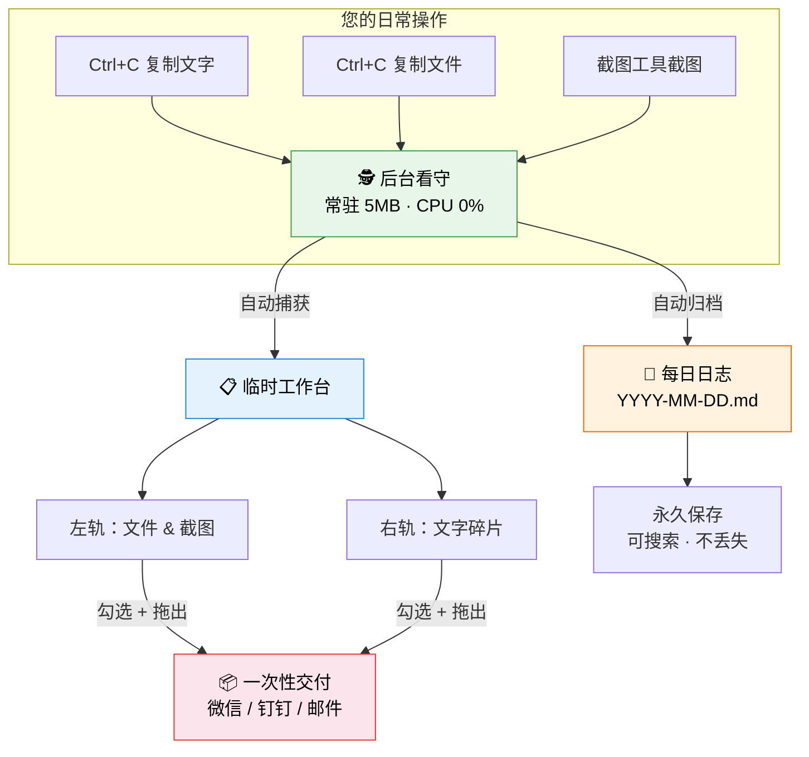
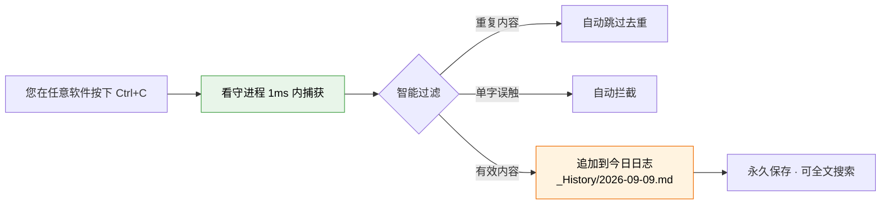
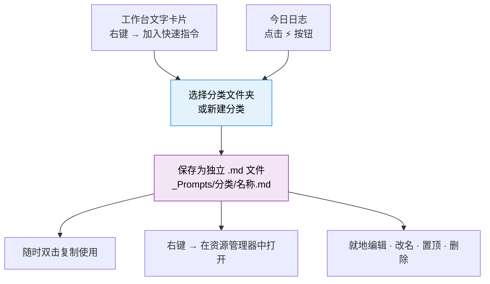
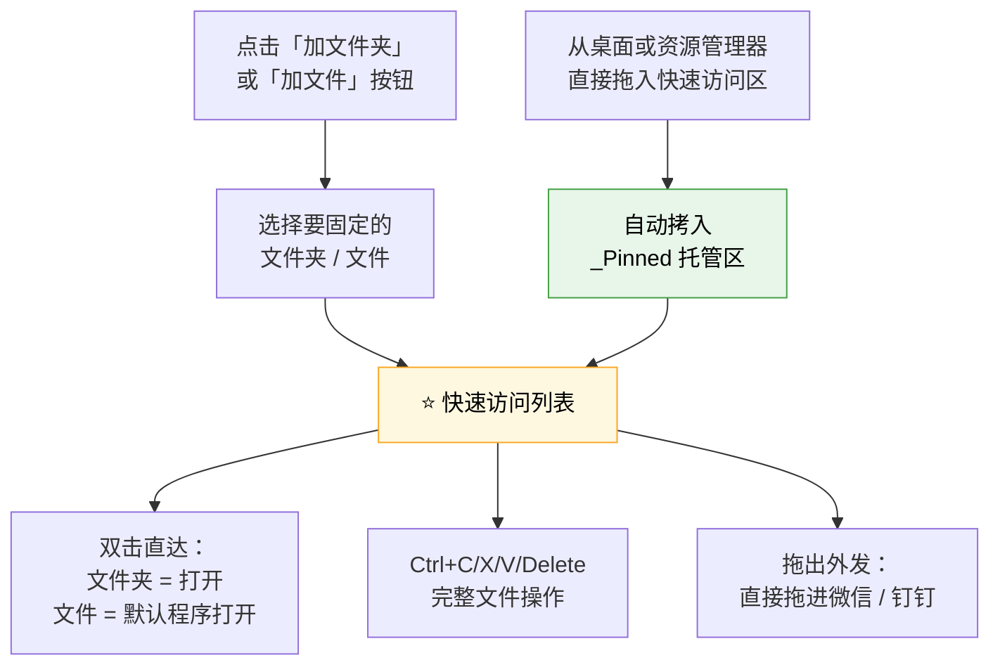
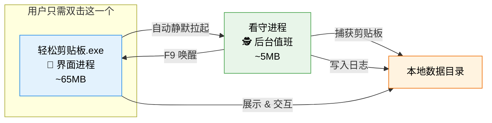

<p align="center">
  <h1 align="center">📋 轻松剪贴板 · EasyClipboard</h1>
  <p align="center">
    <b>你的桌面剪贴板，本该比记忆更可靠。</b><br/>
    一款开源、轻量、隐私至上的 Windows 剪贴板增强工具。<br/>
    复制即归档 · 一贴一拖 · 永不遗忘。
  </p>
  <p align="center">
    <a href="./README_EN.md">English</a> · 
    <a href="#-快速开始">快速开始</a> · 
    <a href="#-功能全景">功能全景</a> · 
    <a href="#-下载安装">下载安装</a> · 
    <a href="#-参与贡献">参与贡献</a>
  </p>
  <p align="center">
    
    
    
    
    
    
  </p>
</p>

---

## 🤔 为什么需要 EasyClipboard？

> 你有没有经历过这样的崩溃瞬间——

- 你精心整理了一段会议纪要，按下 `Ctrl+C`，然后切到微信准备发送……结果手滑复制了别的东西，**刚才的内容永远消失了**。
- 你在浏览器、文档、聊天窗口之间来回切换，一天下来复制了几十条重要信息，但到了晚上想回忆某条关键数据时，**一条都找不回来**。
- 你给同事发文件，要把 3 张图片、2 段文字、1 个 PDF 凑齐发过去，**只能一个一个复制粘贴，重复 6 次机械操作**。
- 你积累了很多常用的提示词、模板、话术，但它们散落在各种便签、文档、备忘录里，**想用的时候根本找不到**。

**这些痛点，正是我们打造「轻松剪贴板」的原因。**

它不是一个大而全的效率平台，它只做一件事——**让你的剪贴板变得可靠、有记忆、够聪明**。

---

## ✨ 功能全景

### 🏗️ 核心架构：双轨制高效中转



### 📋 临时工作台（Staging Shelf）——一贴一拖，用完即清

| 操作 | 效果 | 痛点解决 |
| :--- | :--- | :--- |
| **复制任何内容** | 自动出现在工作台卡片中 | 告别"复制了什么来着？" |
| **单击卡片** | 勾选进底栏交付清单 | 不用瞄准小复选框 |
| **双击文字卡** | 立即复制全文到剪贴板 | 比翻历史记录快 10 倍 |
| **双击文件/图片卡** | 默认程序直接打开 | 不用找文件在哪 |
| **底栏「拖出交付」** | 把勾选的素材整包拖进微信/钉钉 | **一次拖拽 = 替代 N 次复制粘贴** |
| **空格键** | 极速大图预览 / 文字全文预览 | 不用打开就能看 |

> **零拷贝理念**：复制文件时只记录路径引用，绝不重复占用磁盘空间。

### 📓 永久工作记忆（Daily Clipboard Journal）——复制即归档，永不遗忘



- 每天自动生成一篇 `YYYY-MM-DD.md` 日志文件
- 内容去重 + 单字误触过滤，绝不刷屏
- 独立存放在 `_History/` 目录，清空工作台也绝不影响
- **就算主界面整天都没打开，后台看守也会默默帮你记录每一条**

### ⚡ 快速指令（提示词收藏夹 & Markdown 知识库）

日常工作中，你一定有很多反复使用的文字片段：AI 提示词、邮件模板、常用话术、代码片段……



- 每段提示词都是**本地独立的 `.md` 文件**，不锁定在任何私有格式中
- **资源管理器直通**：右键即可在 Windows 资源管理器中定位、编辑、管理
- 双向实时同步：外部修改后点击刷新即可对账
- 文件名严格限制 ≤ 30 字，自动清洗特殊字符

### ⭐ 快速访问区（常用文件夹 & 文件收藏夹）

你的电脑里一定有几个每天都要打开的文件夹或文件——项目目录、设计稿、Excel 报表、常用文档……每次都要在资源管理器里一层层翻找，效率极低。

**快速访问区**就是你的**本地文件快捷收藏夹**，把最常用的文件夹和文件固定在这里，双击直达，再也不用翻文件夹。



| 操作 | 效果 |
| :--- | :--- |
| **加文件夹 / 加文件** | 从电脑中选取常用路径，固定为快捷入口 |
| **拖入文件** | 从外部拖入即收纳，源文件不动（拷贝语义） |
| **双击条目** | 文件夹直接打开；文件用默认程序打开 |
| **Ctrl+C / X / V** | 完整的复制、剪切、粘贴文件操作（与资源管理器互通） |
| **Delete** | 仅删除快速访问区内的副本，外部源文件绝不受影响 |
| **拖出外发** | 选中后直接拖入微信 / 钉钉发送 |

> 💡 清空工作台临时素材**绝不影响**快速访问区里的固定内容。

### 🪟 窗口形态与自由摆放

| 形态 | 说明 |
| :--- | :--- |
| 📋 **完整面板** | 左右双轨 + 底栏交付 + 今日日志 + 快速指令 |
| 🗂️ **小方块模式** | 点击 `—` 折叠为 96×96 彩色图标，自由拖放到屏幕任意角落 |
| 👻 **完全隐藏** | 按 Esc 或 `✕` 隐藏到后台，按 F9 随时召回 |
| 📌 **置顶钉** | 点击置顶，永远悬浮在最上层 |

### ⌨️ 全局快捷键

| 快捷键 | 功能 |
| :--- | :--- |
| `F9` | 全局呼出 / 隐藏面板（即使窗口不在前台也有效） |
| `F10` | 暂停 / 恢复剪贴板自动捕获（复制密码前按一下） |
| `Esc` | 快速隐藏主窗口 |
| `Space` | 选中卡片后极速预览 |

### ⚙️ 更多特性

- 🎨 **深色 / 浅色主题**自由切换，支持毛玻璃磨砂效果
- 🔒 **隐私至上**：所有数据 100% 本地存储，不联网、不上传、无遥测
- 💾 **绿色免安装**：解压即用，不写注册表（除可选的开机自启）
- 🪶 **极致轻量**：界面进程 ~65MB + 后台看守仅 ~5MB，合计 ≤ 70MB
- 🚀 **开机自启**：可选注册为开机启动，电脑一开就默默工作

---

## 🏛️ 架构设计：为什么需要双进程？



| 对比 | 界面进程（前台） | 看守进程（后台） |
| :--- | :--- | :--- |
| **角色** | 迎宾大厅：负责所有可视化交互 | 库房值班员：负责捕获、记录、热键 |
| **何时运行** | 按需出现，不用时可完全关闭 | 24/7 常驻，开机就值班 |
| **内存占用** | ~65MB（含 Qt 渲染引擎） | **仅 ~5MB**（纯 Win32 API，CPU 0%） |
| **崩溃隔离** | 界面闪退不影响数据安全 | 看守独立运行，数据绝不丢失 |

> **用户体验**：您永远只需要双击《轻松剪贴板.exe》这一个文件。后台看守会被自动静默拉起，全程零感知。

---

## 📦 下载安装

### 方式一：下载预构建版（推荐）

1. 前往 [Releases](../../releases) 页面
2. 下载最新版本的 `EasyClipboard-vX.X.X-win64.zip`
3. 解压到任意目录
4. 双击 `轻松剪贴板.exe` 即可运行

> 💡 绿色免安装，无需管理员权限。想卸载？直接删除文件夹即可。

### 方式二：从源码运行

```bash
# 1. 克隆仓库
git clone https://github.com/CatBoss-Paw/EasyClipboard.git
cd EasyClipboard

# 2. 安装依赖（建议使用虚拟环境）
pip install -r requirements.txt

# 3. 启动（先启动看守，再启动界面）
pythonw watchdog.pyw          # 后台看守（无窗口）
python shelf_app.py           # 主界面
```

### 方式三：自行打包

```bash
pip install pyinstaller
python -m PyInstaller --noconfirm --clean EasyClipboard.spec
# 产物在 dist/EasyClipboard/ 目录
```

---

## 🗂️ 项目结构

```
EasyClipboard/
├── shelf_app.py           # 界面进程（PyQt6 主程序）
├── watchdog.pyw           # 看守进程（纯 Python + Win32，无 Qt 依赖）
├── prompts_store.py       # 快速指令存储层
├── icons.py               # QPainter 自绘矢量图标库（macOS 风格）
├── EasyClipboard.spec     # PyInstaller 打包配置
├── requirements.txt       # Python 依赖
├── tests/                 # 测试套件（直接 python tests/xxx.py 运行）
├── _TempShelf/            # 临时工作台数据（运行时自动创建）
├── _History/              # 每日剪贴日志（运行时自动创建）
├── _Prompts/              # 快速指令收藏夹（运行时自动创建）
└── dist/EasyClipboard/    # 打包产物目录
    ├── 轻松剪贴板.exe      # ← 唯一入口，双击即用
    └── _internal/          # 运行时依赖（含看守进程）
```

---

## 🔒 隐私声明

**轻松剪贴板** 坚守以下隐私承诺：

- ✅ 所有数据 **100% 本地存储**，绝不联网上传
- ✅ 不含任何遥测（telemetry）、分析（analytics）或追踪代码
- ✅ 不读取剪贴板以外的任何系统信息
- ✅ 完全开源，代码可审计

---

## 🛠️ 技术栈

| 组件 | 技术 |
| :--- | :--- |
| 语言 | Python 3.12+ |
| 界面框架 | PyQt6（纯 Widgets，不含 WebEngine） |
| 全局热键 | [keyboard](https://github.com/boppreh/keyboard) |
| 剪贴板监听 | Win32 API（ctypes 直调，零第三方依赖） |
| 图标系统 | QPainter 矢量自绘（macOS 细线风格） |
| 打包 | PyInstaller（onedir 模式，绿色免安装） |
| 数据格式 | JSON + Markdown（人类可读，随时迁移） |

---

## 🤝 参与贡献

非常欢迎任何形式的贡献！

1. **Fork** 本仓库
2. **创建特性分支**：`git checkout -b feature/amazing-feature`
3. **提交更改**：`git commit -m 'feat: 添加某某功能'`
4. **推送分支**：`git push origin feature/amazing-feature`
5. **发起 Pull Request**

### 贡献方向建议

- 🍎 **macOS 适配**：界面使用 PyQt6 跨平台，但看守进程的剪贴板监听需要平台适配
- 🐧 **Linux 适配**：Wayland / X11 剪贴板协议适配
- 🌍 **国际化**：目前仅支持中文界面，欢迎贡献多语言翻译
- 🎨 **主题扩展**：更多配色方案与主题包

### 运行测试

```bash
# 使用 Python 3.12+ 直接运行（无 pytest 依赖）
python tests/test_watchdog_dedupe.py      # 去重逻辑
python tests/test_prompts_store.py        # 快速指令存储
python tests/test_prompts_ui.py           # 快速指令界面
python tests/test_cursor_edge_filter.py   # 边缘缩放
python tests/test_smallblock.py           # 小方块模式
python tests/smoke_ctor.py               # 构造冒烟
```

---

## 📄 开源协议

本项目基于 [MIT License](./LICENSE) 开源。

---

## ⭐ 致谢

如果这个项目对你有帮助，请给一个 ⭐ Star，这是对我们最大的鼓励！

---

<p align="center">
  <i>「每一次 Ctrl+C，都值得被温柔以待。」</i>
</p>
