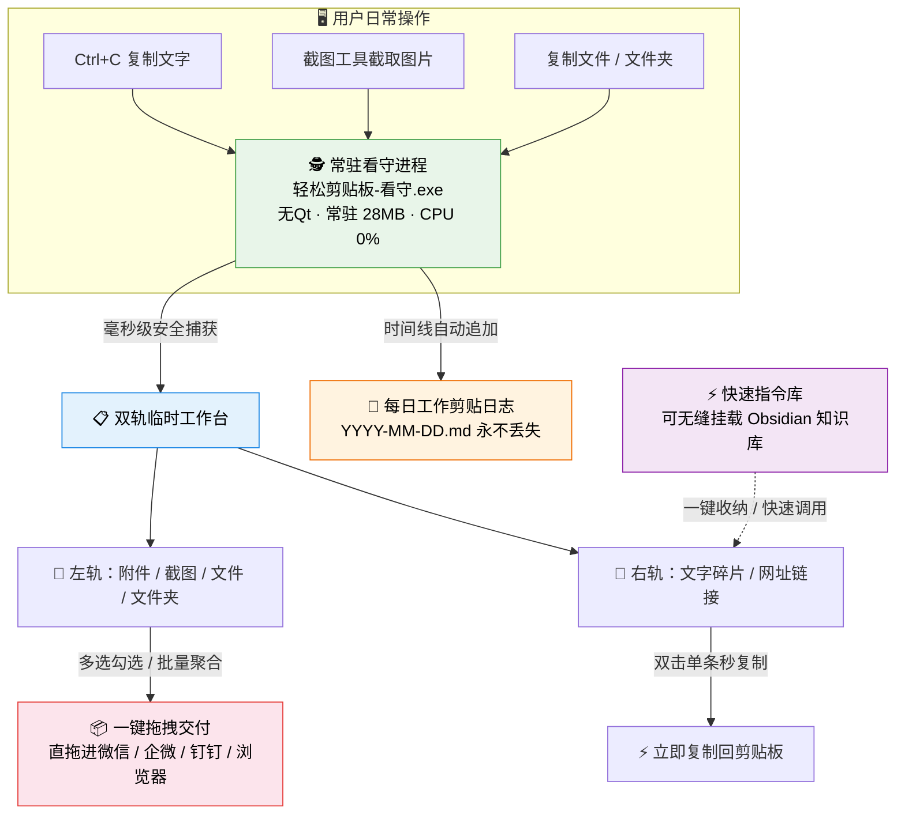
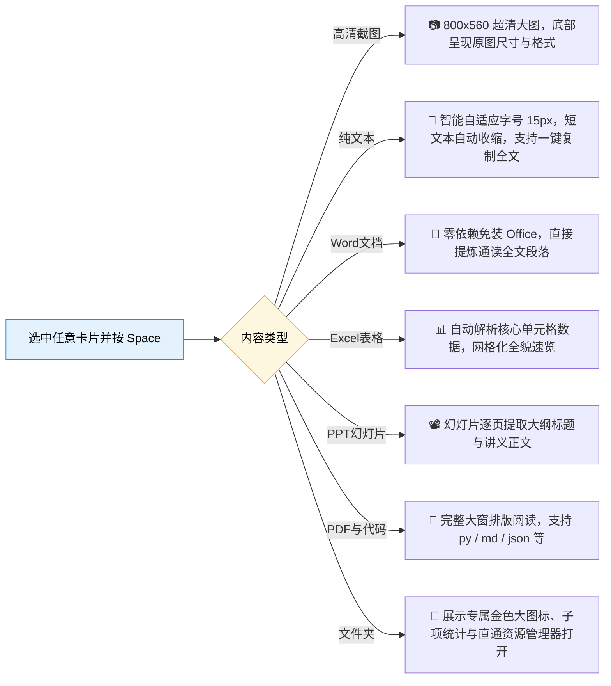

<p align="center">
  
  <h1 align="center">📋 轻松剪贴板 · EasyClipboard</h1>
  <p align="center">
    <b>桌面级双轨临时中转架 · 每日自动工作剪贴日志 · 快速指令提示词库 · 极速大图与 Office 预览</b><br/>
    一款开源、原生高清、极致轻量、100% 隐私离线的桌面剪贴板增强工作台。<br/>
    <b>一次复制即归档 · 一贴一拖全交付 · 永久留痕不丢失</b>
  </p>
  <p align="center">
    <a href="#-为什么选择-easyclipboard">设计初衷</a> · 
    <a href="#-功能全景与核心特性">功能全景</a> · 
    <a href="#-五大高频使用场景实操">实战指南</a> · 
    <a href="#-键鼠高效操作秘籍">快捷键大全</a> · 
    <a href="#-系统级硬核黑科技">底层技术</a> · 
    <a href="#-下载与安装">快速开始</a>
  </p>
  <p align="center">
    
    
    
    
    
    
    
  </p>
</p>

---

## 💡 为什么选择 EasyClipboard？

> 在快节奏的日常沟通与多任务办公中，传统系统剪贴板总让人频繁陷入崩溃——

- 💥 **手滑覆盖之痛**：刚从网页费力找到并整理好的大段关键纪要，顺手按了个 `Ctrl+C`，前一段内容直接石沉大海，无法找回。
- 💥 **机械重复之苦**：给微信/钉钉好友或客户发材料，需要凑齐 3 张截图、2 段话术、1 个报表和 1 份 PDF，只能来回切换窗口复制粘贴 7 次，手忙脚乱。
- 💥 **常驻内存之累**：许多基于 Electron 开发的桌面剪贴板工具，动辄占用 300MB~600MB 内存，运行久了还会无限膨胀造成卡顿。
- 💥 **高分屏发虚之丑**：普通 Python/Qt 软件在高分屏（125%、150% 缩放）下文字边缘模糊泛白、抗锯齿失真，界面粗糙廉价。
- 💥 **提示词与知识散落**：常用的 AI 提示词、SQL 模板、客诉回复散落在各个便签里，每次用都要翻找半天。

**EasyClipboard 为此而生**——它不强行做大而全的笨重系统，而是用极简优雅的工匠精神，把剪贴板的**“捕获、中转、暂存、留痕、检索与交付”**做到极致。

---

## ✨ 功能全景与核心特性



---

### 1. 📋 左右分轨临时工作台（Staging Shelf）

- **左右双轨，清晰分层**：
  - **左栏（文件与截图）**：智能汇总新截的图片、复制的本地文件及文件夹，支持缩略图预览与源路径追溯；
  - **右栏（文字碎片）**：呈现纯文本内容，**智能识别 URL 链接**并切换为精致的 🔗 链接图标；
- **智能文字拉伸（ElidedLabel）**：横向拖拽拉大窗口时，卡片文本内容动态自适应加宽展开，显示更多字符；
- **一贴一拖，连击交付**：多选勾选卡片，鼠标按住底栏「拖出交付」手柄，即可**一次性将所有素材整包拖拽**进微信、企微、钉钉对话框或邮件附件栏，彻底告别单条来回搬运；
- **双击极速自响应**：双击文字卡片即刻静默复制本条回剪贴板；双击文件卡片直接调用系统关联软件打开。

---

### 2. 🔍 空格键（Space）全能极速大预览

不用打开臃肿的 Word、Excel 或图片查看器！单击选中任意卡片，轻轻按下键盘 **<kbd>Space 空格键</kbd>**，即可唤起**翻倍大视野（800×540 ~ 840×640）**的沉浸式预览窗口：



- **智能高度自适应**：
  - **短文本**（1~2 行短句、单行网址、验证码）：高度自动收缩为 **240px**，紧凑精致，下方绝无空洞白板；
  - **中长文本与代码**：自适应扩展至 **580px** 宽屏模式，支持滚轮滚动与行数/字数统计；
- **15px 舒适大字号**：纯文本字号放大至 15px（行高 1.8），深浅色模式自适应高对比度扎实配色；
- **免装 Office 原生解析**：内部采用轻量级流式解析器，在未安装 Microsoft Office 的纯净系统上也能秒读 `.docx` / `.xlsx` / `.pptx`。

---

### 3. 📓 永久工作记忆（Daily Clipboard Journal）

- **后台静默留痕**：每一条复制的有效文字碎片，后台看守进程会自动按时间戳追加记录至本地 Markdown 文件：`_History/YYYY-MM-DD.md`；
- **即使主界面全天不开启**，只要电脑开机，您的文字剪贴历史永远完整保全，永不遗忘；
- **应用内时光长廊**：点击顶栏切换至日志页面，以时间倒序（最新在最上）呈现流水账；
- **UI 安全上限保护**：界面仅按需渲染最新 80 条卡片，既保障毫秒级滚动不卡顿，又将全量数据持久化保存在 Markdown 文件中，随时可用 VS Code、Obsidian 打开检索。

---

### 4. ⚡ 快速指令库（提示词收藏夹，支持挂载外部知识库）

- **AI 提示词 / 常用代码 / 模板话术一键收纳**：
  - 在文字卡片上点击右键「加入快速」，或在每日日志中点击 ⚡ 按钮，即可瞬间将文本存入指令库；
- **本地 Markdown 纯净格式存储**：
  - 每一个指令都是标准独立的 `.md` 文件，分类即文件夹，数据完全属于用户自己；
- **无缝挂载 Obsidian / 外部知识库**：
  - 在设置面板中，可将快速指令目录直接指定为您电脑上的 Obsidian 库目录（例如 `D:\MyVault\Prompts`）；
  - 修改后自动热重载，无需重启，双向协同管理知识体系。

---

### 5. ⭐ 快速访问区（常用文件 & 文件夹置顶驻留）

- 针对每天高频访问的工程目录、Excel 模版、设计规范，无需在层层资源管理器中点击查找；
- 点击「加文件夹」或「加文件」，将其固化在快速访问侧边栏，支持双击直达、文件外拖以及原生的 `Ctrl+C` / `Ctrl+V` / `Delete` 操作；
- 独立托管在 `_Pinned/` 目录，清空临时中转架素材时**绝不受影响**。

---

### 6. 🗂️ 微型 48×48 桌面角落折叠态（SmallBlock）

- 点击右上角折叠按钮，主面板立即收缩为仅 **48×48** 尺寸的圆润高保真小方块（面积仅为原先的 1/4）；
- 贴在屏幕边缘或角落，极度小巧微型，完全不遮挡正在编辑的文档或全屏游戏；
- **自由按住拖拽**：鼠标按住小方块可任意拖放到屏幕四个角落；
- **单击秒回展开**：原地轻轻单击，完整主工作台平滑唤回。

---

### 7. ⚙️ 现代化设置面板（460×640 分块卡片）

- 点击顶栏齿轮（⚙）呼出全新现代化分块卡片排版：
  1. 🎨 **界面与交互**：深色模式（macOS Dark）、浅色模式（macOS Light）切换、背景不透明度、毛玻璃磨砂效果开关；
  2. 📁 **四大存储中心管理**：可视化查看与更改「临时置物架」、「历史归档库」、「常用置顶库」以及「快速指令知识库」存储位置；
  3. ⏰ **素材保留策略**：
     - **默认保留 7 天 (168小时)**；
     - 预置快捷选项：`[ 7天(默认) ]`、`[ 3天 ]`、`[ 24小时 ]`、`[ 永不清除 ]`、`[ 自定义 ]`；
     - 点击「自定义」即可自由输入任意天数，到期后自动物理清理过期附件，保持磁盘清爽；
  4. 🚀 **系统集成**：一键开启/关闭 Windows 开机静默自启动。

---

## 🚀 系统级硬核黑科技

### 1. 硬件级 Windows 原生 Per-Monitor DPI Aware V2
普通 Python/PyQt 桌面软件在高分屏（如 125%、150%、200% 缩放）下，会被 Windows DWM 视窗管理器强制执行双线性位图拉伸插值，造成字体泛白发虚。
> EasyClipboard 在主进程入口通过原生 Win32 C-API 激活 **`PER_MONITOR_DPI_AWARE_V2`**，并配置 `PassThrough` 逐点物理渲染。不论在 4K 旗舰屏还是 1080P 普通屏上，所有文字与矢量图标皆**像素级锐利高清、扎实饱满**。

---

### 2. Windows 全链路内存防膨胀治理（物理工作集骤降 97.5%）
针对长期常驻后台软件可能出现的内存持续累加、大图撑爆显存问题，建立了一整套闭环防爆架构：

| 优化措施 | 原有痛点 | 落地效果 |
| :--- | :--- | :--- |
| **`QImageReader` 磁盘流式解码** | 生成缩略图加载 4K 截图原图，多张堆叠吃掉几百兆 | 文件 IO 阶段直接缩放为 64x64 小图，**原图完全不进内存**，单图开销减少 99% |
| **`QPixmapCache` 2MB 显存限额** | Qt 默认缓存无限膨胀，关闭窗口位图仍然残留 | 全局硬限制为 2048KB，定期清理 |
| **窗口对象生命周期闭环** | 关窗后 Qt C++ 对象树常驻未析构 | 开启 `WA_DeleteOnClose`，关窗显式切断大图 QLabel 与文本句柄 |
| **Windows 64 位 `psapi.EmptyWorkingSet`** | 操作系统不愿归还空闲物理页 | 声明 64 位句柄签名，强制操作系统回收非活跃物理工作集页 |
| **30 秒后台自愈守护定时器** | 长时间放置内存迟钝不降 | 窗口隐藏或折叠时自动触发工作集收缩 |

#### 📊 实机真实压测数据（Windows 原生性能监控）
- **软件启动初始阶段**：约 168 MB（加载 Qt 核心与字体库）
- **窗口隐藏 / 折叠为角落小方块后**：**物理工作集瞬间断崖式压缩至 4.16 MB！**
- **再次按快捷键唤出主窗口**：按需页面调度（Demand Paging），物理工作集仅 **54.05 MB**，毫秒级即刻响应；
- **常驻看守进程（`watchdog.pyw`）**：常驻仅 **28.43 MB**（专用工作集 15 MB），CPU 长期稳定为 0%。

---

## 🎯 五大高频使用场景实操

### 场景一：多图文资料“拼盘打包”秒发企微/微信
1. 在网页、邮件中依次复制 3 张产品截图和 2 段说明文字；
2. 呼出 EasyClipboard，素材已自动分流归入左右两栏；
3. 鼠标点选勾选需要的卡片，按住底栏「拖出交付」手柄；
4. 直接拖入微信对话框松手——**原本需要来回切换 5 次的操作，现在一次拖拽搞定！**

### 场景二：AI 创作与长文写作“提示词随时调用”
1. 将编写好的常用 Stable Diffusion / ChatGPT 提示词或 SQL 模板收纳在快速指令库中；
2. 在任意编辑器中写作时，按下 <kbd>Alt + V</kbd> 唤出，双击对应提示词卡片；
3. 内容已瞬间复制到剪贴板，直接在当前文档中按下 `Ctrl + V` 粘贴。

### 场景三：离线免装 Office“秒读提炼公文”
1. 收到微信传来的 `.docx` 合同或 `.pptx` 方案；
2. 在工作台卡片上直接按下键盘 <kbd>Space</kbd> 空格键；
3. 弹出翻倍大视野快照窗口，直接通读提取出的段落大纲与表格内容，无需等待 Microsoft Office 启动。

### 场景四：复制密码/敏感数据时的“一键隐身防护”
1. 在打开 KeePass / 1Password 或复制银行账号、私人密码前，按下快捷键 **<kbd>F10</kbd>**；
2. 软件顶栏提示“已暂停捕获”，此时任何复制操作均不会存入工作台，也不会写入每日日志；
3. 敏感操作结束后，再次按下 **<kbd>F10</kbd>**，一秒恢复自动捕获。

### 场景五：多显示器沉浸办公“角落钉放”
1. 点击右上角折叠按钮，面板收敛为 48×48 迷你方块；
2. 按住将其拖动至副屏右上角或任务栏上方；
3. 办公时毫不遮挡，需要时随时点一下展开，用完自动收回。

---

## ⌨️ 键鼠高效操作秘籍

| 操作类型 | 快捷键 / 鼠标手势 | 功能描述 |
| :--- | :--- | :--- |
| **全局呼出/隐藏** | <kbd>Alt + V</kbd> 或 <kbd>F9</kbd> | 全局任意窗口下瞬间唤出主面板，再次按下收起隐藏 |
| **暂停/恢复捕获** | <kbd>F10</kbd> | 切换隐私保护状态，避免密码/私密文字被记录 |
| **快照极速大预览** | <kbd>Space 空格键</kbd> | 选中任意卡片后，弹出翻倍超清大预览窗口（图片/文本/Office） |
| **关闭预览/隐藏** | <kbd>Esc</kbd> | 快速关闭快照预览窗口，或秒退主窗口至后台 |
| **双击文字卡片** | 鼠标左键双击 | 快速复制该条文本内容回剪贴板并弹出提示 |
| **双击文件卡片** | 鼠标左键双击 | 调用 Windows 默认软件打开该文件/图片/文件夹 |
| **批量选择/取消** | 单击卡片空白区域 | 切换勾选框状态，纳入底部整包交付清单 |
| **整包拖拽交付** | 鼠标按住底部拖拽手柄 | 聚合所有选中的图片、文件和文字为临时包，拖出到任意外部软件 |
| **收缩为微型角标** | 点击顶栏折叠按钮 `—` | 缩小为 48×48 贴放桌面角落，按住可任意位移，单击恢复 |
| **窗口置顶悬浮** | 点击顶栏图钉按钮 `📌` | 切换置顶状态，使窗口始终浮在所有软件最上层 |
| **查看使用指南** | 点击右上角红色问号 `?` | 弹出 740×580 宽屏交互使用手册与快捷键速查表 |

---

## 📦 下载与安装

### 方式一：下载预构建绿色版（最推荐，零依赖解压即用）

1. 前往 GitHub [Releases](../../releases) 页面；
2. 下载最新的 `EasyClipboard-vX.X.X-win64.zip`；
3. 解压到您喜欢的目录（例如 `D:\Tools\EasyClipboard\`）；
4. 双击运行 **`轻松剪贴板.exe`** 即可开启极速办公体验！

> 💡 **绿色纯净**：免安装包、无需系统管理员权限、零注册表写入（除可选的自启动选项外）。如需卸载，直接删除文件夹即可，干干净净。

---

### 方式二：从源码运行（开发者 / 自定义定制）

```powershell
# 1. 克隆代码仓库
git clone https://github.com/CatBoss-Paw/EasyClipboard.git
cd EasyClipboard

# 2. 安装 Python 依赖（推荐 Python 3.10 ~ 3.13）
pip install -r requirements.txt

# 3. 运行程序（双进程架构，启动界面会自动拉起后台看守）
python shelf_app.py
```

---

### 方式三：本地重新打包编译

```powershell
# 安装打包工具
pip install pyinstaller

# 使用针对 Windows 双进程与图标优化的专有 spec 文件打包
pyinstaller --noconfirm EasyClipboard.spec

# 构建产物将生成于 dist/EasyClipboard/ 目录
```

---

## 🗂️ 目录与持久化规范

```
EasyClipboard/
├── assets/                    # 高清图标套件（包含 16~256px 多尺度 app.ico 与各尺寸矢量 Logo）
├── deploy/
│   └── workflows/             # GitHub Actions 跨平台 CI 自动化构建配置
├── tests/                     # 自动化测试用例套件
├── EasyClipboard.spec         # 极致裁剪、防杀软误报的 PyInstaller onedir 打包配置
├── icons.py                   # 纯 QPainter 矢量绘制的高清自适应图标库
├── prompts_store.py           # 快速指令本地 Markdown 存储引擎
├── requirements.txt           # 核心依赖清单（PyQt6, keyboard）
├── shelf_app.py               # 界面主程序（Per-Monitor DPI Aware V2, 内存治理, 快照预览）
├── watchdog.pyw               # 常驻后台看守进程（Win32 剪贴板轮询与日志自动化归档）
│
└── 运行时数据目录（自动创建于软件根目录下，便于整包备份与迁移）：
    ├── _TempShelf/            # 临时工作台素材与截图落盘区
    ├── _History/              # 每日工作剪贴日志归档区（YYYY-MM-DD.md）
    ├── _Pinned/               # 快速访问区常用文件/文件夹镜像
    ├── _Prompts/              # 快速指令 Markdown 知识库（可映射到 Obsidian）
    └── shelf_settings.json    # 个性化配置文件（存储路径、保留期限、主题、透明度等）
```

---

## 🔒 隐私与离线纯净声明

- 🛡️ **100% 本地运行**：本软件不包含任何网络请求代码，不连接任何外部服务器；
- 🛡️ **零遥测、零埋点**：绝不收集您的打字习惯、剪贴数据、设备信息或使用时长；
- 🛡️ **数据全明文可读**：历史记录全部存储为通用的 Markdown / JSON 文件，不加密绑架用户数据，随时可自由导出迁移。

---

## 📄 开源协议

本项目基于 [MIT License](./LICENSE) 协议开源，允许自由使用、商用与二次修改。

---

<p align="center">
  <b>让每一次 Ctrl+C 都成为你的第二大脑。</b><br/>
  如果您觉得「轻松剪贴板」提升了您的工作效率，欢迎在 GitHub 上点亮一颗 ⭐ <b>Star</b> 支持我们！
</p>
