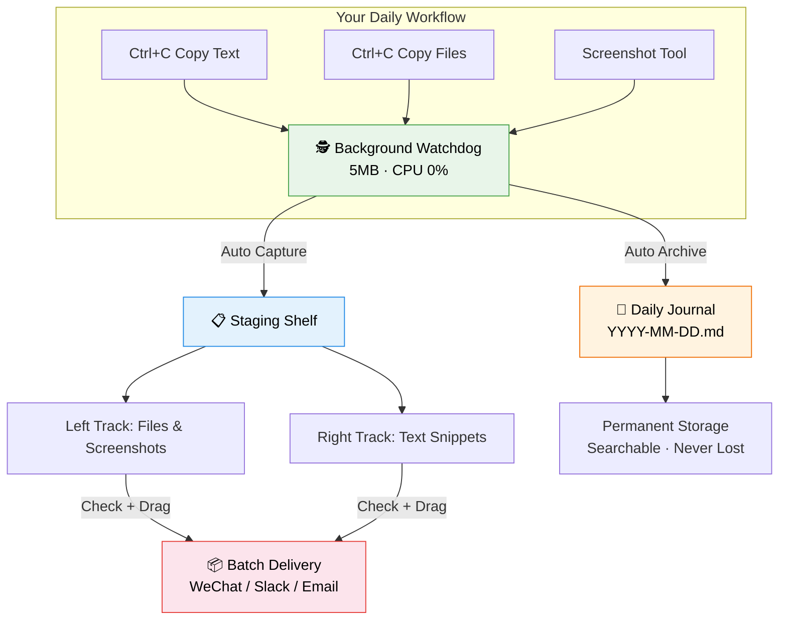
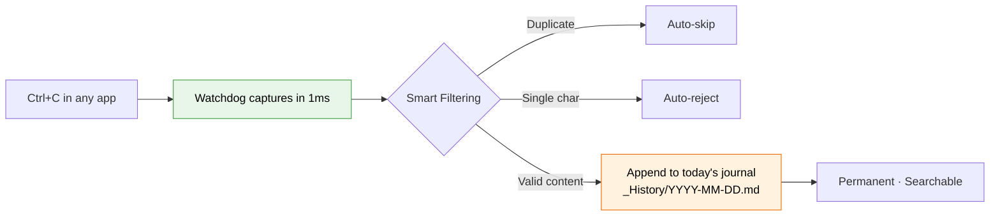
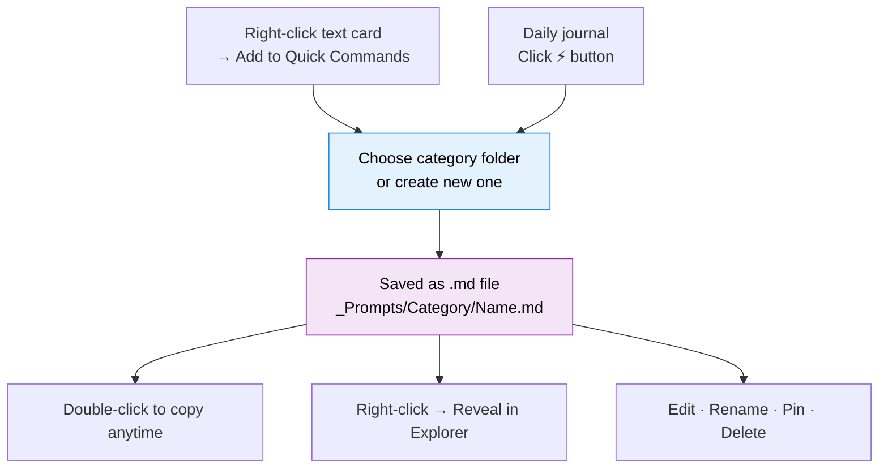
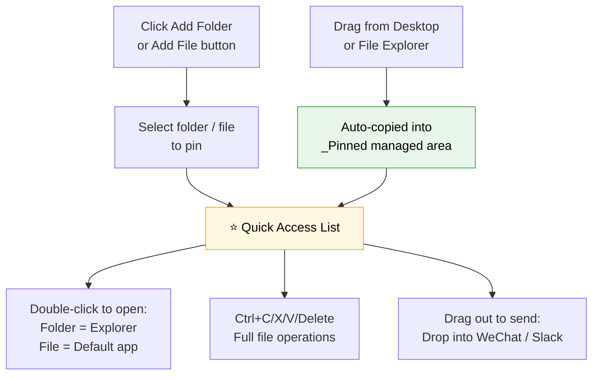
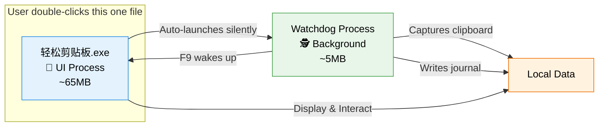

<p align="center">
  <h1 align="center">📋 EasyClipboard</h1>
  <p align="center">
    <b>Your clipboard deserves a memory.</b><br/>
    An open-source, lightweight, privacy-first clipboard enhancer for Windows.<br/>
    Auto-archive · Drag-to-deliver · Never forget.
  </p>
  <p align="center">
    <a href="./README.md">中文</a> · 
    <a href="#-quick-start">Quick Start</a> · 
    <a href="#-features">Features</a> · 
    <a href="#-download">Download</a> · 
    <a href="#-contributing">Contributing</a>
  </p>
  <p align="center">
    
    
    
    
    
    
  </p>
</p>

---

## 🤔 The Problem

Every knowledge worker faces these frustrations daily:

- **Lost clipboard content**: You carefully copied meeting notes, switched to WeChat to send them… then accidentally copied something else. The original content is **gone forever**.
- **No clipboard history**: You copied dozens of important snippets throughout the day — URLs, code blocks, addresses, key phrases — but by evening, **you can't recall a single one**.
- **Tedious multi-item sharing**: Sending 3 images, 2 text blocks, and a PDF to a colleague means **6 separate copy-paste cycles**.
- **Scattered templates**: Your frequently-used prompts, email templates, and code snippets are spread across random sticky notes and documents, **impossible to find when you need them**.

**EasyClipboard was built to solve exactly these problems.**

It does one thing exceptionally well — **making your clipboard reliable, intelligent, and never forgetful**.

---

## ✨ Features

### 🏗️ Dual-Track Architecture



### 📋 Staging Shelf — Copy, Check, Drag, Done

| Action | Effect | Pain Point Solved |
| :--- | :--- | :--- |
| **Copy anything** | Appears as a card on the shelf | "What did I just copy?" |
| **Single-click a card** | Toggles selection for delivery | No tiny checkbox to aim at |
| **Double-click text card** | Instantly copies full text | 10x faster than scrolling history |
| **Double-click file/image** | Opens with default program | No more hunting for file locations |
| **Drag from bottom bar** | Sends all selected items to chat apps | **1 drag = replaces N copy-pastes** |
| **Spacebar** | Quick preview: full image / full text | See it without opening |

> **Zero-copy philosophy**: File captures store path references only — no disk space wasted on duplicates.

### 📓 Daily Clipboard Journal — Copy Once, Remember Forever



- Automatic daily Markdown journal: `_History/YYYY-MM-DD.md`
- Intelligent deduplication + single-character noise filtering
- Clearing the staging shelf **never** affects journal entries
- **Even if the main window stays closed all day, the watchdog silently records every copy**

### ⚡ Quick Commands (Prompt Library & Markdown Knowledge Base)

Save your frequently-used text snippets as organized, reusable Markdown files:



- Each prompt is a **standalone `.md` file** — no vendor lock-in
- **File Explorer integration**: Right-click to locate and manage files directly
- Bidirectional sync: Edit files externally, refresh to sync
- Filename auto-sanitized and limited to ≤ 30 characters

### ⭐ Quick Access (Favorite Folders & Files)

You probably have a handful of folders and files you open every single day — project directories, design mockups, spreadsheets, reference documents. Navigating through layers of Explorer every time is painfully slow.

**Quick Access** is your **local file bookmark shelf**. Pin your most-used folders and files here, double-click to open instantly — no more digging through directories.



| Action | Effect |
| :--- | :--- |
| **Add Folder / Add File** | Pick frequently-used paths to pin as shortcuts |
| **Drag files in** | Drop from outside to collect; source files untouched (copy semantics) |
| **Double-click entry** | Folders open in Explorer; files open with default program |
| **Ctrl+C / X / V** | Full copy, cut, paste file operations (interoperable with Explorer) |
| **Delete** | Only removes the copy in Quick Access; original source files are never affected |
| **Drag out** | Select items and drag directly into chat apps to send |

> 💡 Clearing the staging shelf **never** affects pinned items in Quick Access.

### 🪟 Window Modes

| Mode | Description |
| :--- | :--- |
| 📋 **Full panel** | Dual-track shelf + delivery bar + daily journal + quick commands |
| 🗂️ **Mini block** | Collapses to a 96×96 icon, draggable to any screen corner |
| 👻 **Hidden** | Press Esc or `✕` to hide; press F9 anytime to recall |
| 📌 **Always on top** | Pin to stay above all windows |

### ⌨️ Global Hotkeys

| Hotkey | Action |
| :--- | :--- |
| `F9` | Show / Hide panel (works even when not focused) |
| `F10` | Pause / Resume clipboard capture (protect passwords) |
| `Esc` | Quick hide |
| `Space` | Quick preview selected card |

### ⚙️ More

- 🎨 **Dark / Light themes** with optional frosted glass effect
- 🔒 **Privacy-first**: 100% local storage, no network, no telemetry
- 💾 **Portable**: Unzip and run, no installer needed
- 🪶 **Ultra-lightweight**: UI ~65MB + Watchdog ~5MB, total ≤ 70MB
- 🚀 **Auto-start**: Optional Windows startup registration

---

## 🏛️ Why Two Processes?



| Aspect | UI Process (foreground) | Watchdog (background) |
| :--- | :--- | :--- |
| **Role** | All visual interaction | Capture, journal, hotkeys |
| **When active** | On-demand; can be fully closed | 24/7 always running |
| **Memory** | ~65MB (Qt rendering) | **~5MB only** (pure Win32, CPU 0%) |
| **Crash isolation** | UI crash won't lose data | Watchdog is independent & resilient |

> **User experience**: Just double-click `轻松剪贴板.exe`. The watchdog is launched automatically and silently — zero configuration needed.

---

## 📦 Download

### Option 1: Pre-built Release (Recommended)

1. Go to the [Releases](../../releases) page
2. Download the latest `EasyClipboard-vX.X.X-win64.zip`
3. Extract to any directory
4. Double-click `轻松剪贴板.exe` to run

> 💡 Portable — no admin rights required. To uninstall, just delete the folder.

### Option 2: Run from Source

```bash
# 1. Clone the repository
git clone https://github.com/CatBoss-Paw/EasyClipboard.git
cd EasyClipboard

# 2. Install dependencies (virtual environment recommended)
pip install -r requirements.txt

# 3. Launch
pythonw watchdog.pyw          # Background watchdog (no window)
python shelf_app.py           # Main UI
```

### Option 3: Build from Source

```bash
pip install pyinstaller
python -m PyInstaller --noconfirm --clean EasyClipboard.spec
# Output: dist/EasyClipboard/
```

---

## 🗂️ Project Structure

```
EasyClipboard/
├── shelf_app.py           # UI process (PyQt6 main application)
├── watchdog.pyw           # Watchdog process (pure Python + Win32, no Qt)
├── prompts_store.py       # Quick commands storage layer
├── icons.py               # QPainter vector icon library (macOS style)
├── EasyClipboard.spec     # PyInstaller build config
├── requirements.txt       # Python dependencies
├── tests/                 # Test suite (run directly: python tests/xxx.py)
├── _TempShelf/            # Staging shelf data (auto-created at runtime)
├── _History/              # Daily clipboard journals (auto-created)
├── _Prompts/              # Quick commands library (auto-created)
└── dist/EasyClipboard/    # Build output
    ├── 轻松剪贴板.exe      # ← Single entry point, double-click to run
    └── _internal/          # Runtime dependencies (includes watchdog)
```

---

## 🔒 Privacy

**EasyClipboard** makes the following privacy commitments:

- ✅ All data stored **100% locally** — nothing is ever uploaded
- ✅ **Zero** telemetry, analytics, or tracking code
- ✅ Does not read any system information beyond the clipboard
- ✅ Fully open-source — every line of code is auditable

---

## 🛠️ Tech Stack

| Component | Technology |
| :--- | :--- |
| Language | Python 3.12+ |
| UI Framework | PyQt6 (pure Widgets, no WebEngine) |
| Global Hotkeys | [keyboard](https://github.com/boppreh/keyboard) |
| Clipboard Monitoring | Win32 API (ctypes, zero third-party deps) |
| Icon System | QPainter vector drawing (macOS thin-line style) |
| Packaging | PyInstaller (onedir mode, portable) |
| Data Format | JSON + Markdown (human-readable, easily migrated) |

---

## 🤝 Contributing

Contributions of all kinds are warmly welcome!

1. **Fork** the repository
2. **Create a feature branch**: `git checkout -b feature/amazing-feature`
3. **Commit changes**: `git commit -m 'feat: add some feature'`
4. **Push the branch**: `git push origin feature/amazing-feature`
5. **Open a Pull Request**

### Suggested Contribution Areas

- 🍎 **macOS support**: The UI uses cross-platform PyQt6, but the watchdog's clipboard monitoring needs platform adaptation
- 🐧 **Linux support**: Wayland / X11 clipboard protocol adaptation
- 🌍 **Internationalization**: Currently Chinese UI only — translations welcome
- 🎨 **Theme extensions**: More color schemes and theme packs

### Running Tests

```bash
# Python 3.12+ required, no pytest dependency
python tests/test_watchdog_dedupe.py      # Deduplication logic
python tests/test_prompts_store.py        # Quick commands storage
python tests/test_prompts_ui.py           # Quick commands UI
python tests/test_cursor_edge_filter.py   # Edge resize cursors
python tests/test_smallblock.py           # Mini block mode
python tests/smoke_ctor.py               # Constructor smoke test
```

---

## 📄 License

This project is licensed under the [MIT License](./LICENSE).

---

## ⭐ Star History

If this project helps you, please give it a ⭐ — it means the world to us!

---

<p align="center">
  <i>"Every Ctrl+C deserves to be remembered."</i>
</p>
